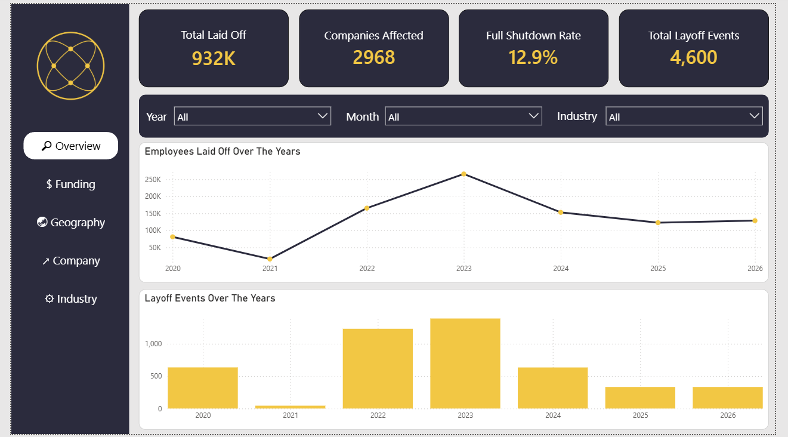
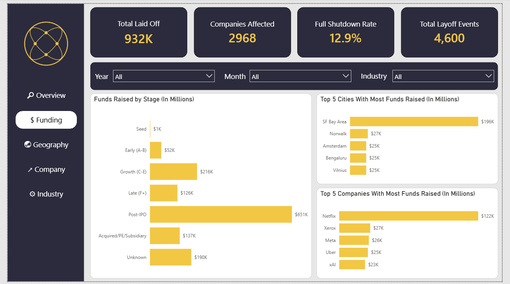
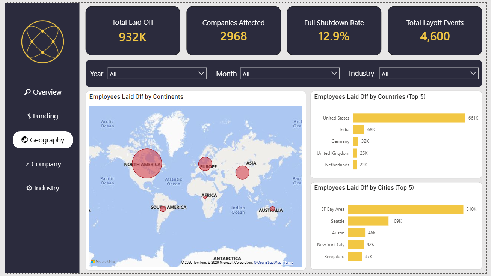
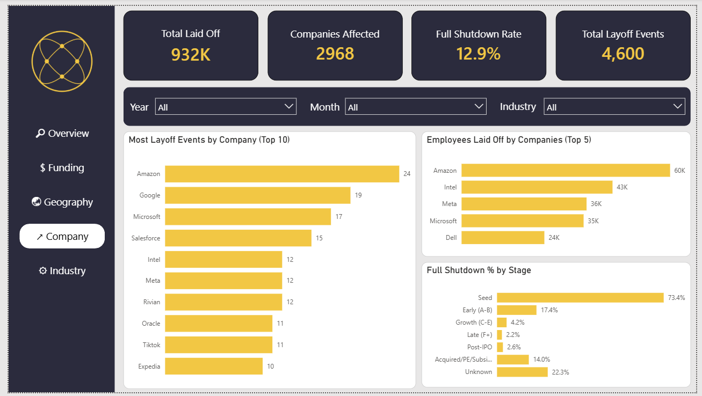
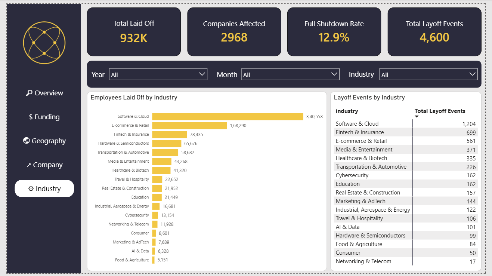

# Global-Tech-Layoffs-Analysis (2020-Present)

Power BI + Excel project analyzing global tech layoffs since March 2020

---

## Description

A Power BI dashboard analyzing global tech layoffs (2020–present) — cleaning messy real-world data using excel and power query, modeling it into a star schema, and building DAX measures to analyze factors such as YOY change, full shutdown rate, companies affected, etc. As a result, a dashboard designed to showcase the analysis in a compact form.

---

## Key Findings

**1) Funding predicts survival, not just severity:** Seed-stage layoffs end in full shutdown 73.4% of the time vs. 2.2% for Late-stage — early companies often have no fallback funding once a round runs out, so a layoff and a shutdown become the same event.

**2) 2023 was the real peak, not 2022:** Likely because companies acted on 2022's rate hikes/VC pullback with a lag, so the effect peaked a year after the cause.

**3) Software & Cloud's lead isn't a one-year spike:** It is consistent with having the largest layoffs from 2020-2026.

**4) SF Bay Area's 33% share is likely inflated by reporting bias, not pure reality:** Layoffs.fyi skews toward well-covered US tech hubs.

 ---

## Challenges

- Frequent missing data. total_laid_off and % laid off are often not disclosed - **Kept as nulls and created a custom dax column to check the disclosure status**
- Missing country/city names - **Handled and cleaned in Excel**
- Too many distinct values in industries and countries - **Created seperate region and industry mappings to create a bucket**
- Undercounts smaller/unreported layoffs - **Unresolved**
- Skews toward US/Western media coverage - **Unresolved**

---

## Setup / Refresh Instructions
- This project reads cleaned data from `data/layoffs_cleaned.xlsx` via Power Query.
- The Power BI file's Source step uses an absolute local file path, which will not work on a different machine.
- To refresh the data yourself:
  - Clone/download this repo
  - Open `Global_Tech_Layoff_Trend.pbix` in Power BI Desktop
  - Go to Transform Data → Data Source Settings
  - Update the path to point to your local copy of `data-and-dashboard/layoffs_cleaned.xlsx`
  - Click Refresh

---

## Screenshots

---

## Data Source

Layoffs.fyi (via Kaggle mirror) — ~4,600 verified layoff events, March 2020–present.
https://www.kaggle.com/datasets/swaptr/layoffs-2022

---

# Tools

Excel · Power Query · Power BI · Claude (DAX, data modeling, report design)

---

## Caution: 

This dataset reflects only publicly reported layoff events and may not represent the complete or fully accurate scope of layoffs globally.
